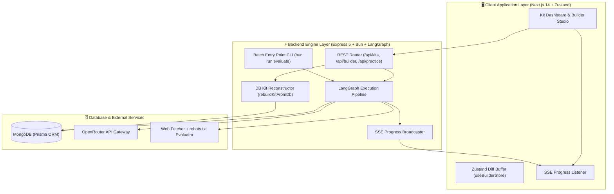

# AI Interview Prep — Client Frontend Application

[](https://github.com/jamesnagar11/interview-prep)

The frontend client for **AI Interview Prep** is a state-of-the-art web application built with Next.js 14 (App Router), React, TailwindCSS, Lucide Icons, and Zustand. It provides an interactive preparation suite featuring live real-time kit generation progress (SSE), an executive Builder Mode Studio with tri-state state preservation, a 3D Flashcard Practice Studio, and a full Mock Exam Simulation with AI Coach Evaluation.

> ℹ️ **Complementary Backend Repository**: This frontend pairs with the Express 5 + Bun backend engine hosted at [https://github.com/jamesnagar11/interview-prep-backend](https://github.com/jamesnagar11/interview-prep-backend). Please see the setup section below for instructions on running both services locally.

---

## Table of Contents

1. [Project Overview & Chosen Tech Stack](#project-overview--chosen-tech-stack)
2. [Setup Instructions (Local & Deployed)](#setup-instructions-local--deployed)
   - [Local Frontend Setup](#local-frontend-setup)
   - [Partner Backend Setup](#partner-backend-setup)
   - [Batch Entry Point (Evaluation CLI)](#batch-entry-point-evaluation-cli)
   - [Deployed Setup](#deployed-setup)
3. [LLM Provider and Model Configuration](#llm-provider-and-model-configuration)
4. [High-Level Architecture](#high-level-architecture)
5. [Retrieval Approach & Sources Used](#retrieval-approach--sources-used)
6. [Sequencing of Research and Generation Steps](#sequencing-of-research-and-generation-steps)
7. [Coverage Pass Decision (`MAX_COVERAGE_PASSES = 3`)](#coverage-pass-decision-max_coverage_passes--3)
8. [Representation of Generated, Edited, and Pinned State](#representation-of-generated-edited-and-pinned-state)
9. [Schedule Allocation Algorithm](#schedule-allocation-algorithm)
10. [Creative Features](#creative-features)
    - [Interactive 3D Flashcards Studio](#interactive-3d-flashcards-studio)
    - [Mock Exam Simulation & AI Coaching Engine](#mock-exam-simulation--ai-coaching-engine)
11. [Edge Cases and Failure Handling](#edge-cases-and-failure-handling)
12. [Key Design Decisions, Trade-offs & Limitations](#key-design-decisions-trade-offs--limitations)

---

## Project Overview & Chosen Tech Stack

### Tech Stack Summary
- **Framework**: [Next.js 14](https://nextjs.org/) (App Router, Server Components & Client Hooks)
- **State Management**: [Zustand](https://github.com/pmndrs/zustand) for client-side local diffing & JWT auth persistence
- **Styling**: Vanilla CSS Modules & TailwindCSS with glassmorphic dark-mode aesthetics
- **Real-Time Communication**: Server-Sent Events (SSE) via `EventSource` with auto-reconnection
- **Icons**: Lucide React Icons

### Tech Stack Justification
1. **Next.js App Router**: Provides fast route rendering, optimal client-side code splitting, and native TypeScript support.
2. **Zustand Store with In-Memory Local Diffing**: Builder Mode allows users to edit questions, reorder categories, and customize flashcards with zero latency UI updates before committing changes in a single atomic batch payload (`commitBuilderChanges`).
3. **Glassmorphic UI Design System**: Premium dark-mode UI styled with custom HSL color accents, category glow effects, and micro-animations to maximize user engagement.

---

## Setup Instructions (Local & Deployed)

### Prerequisites
- Node.js (v18+)
- `npm` or `bun`

---

### Local Frontend Setup

1. **Clone the Frontend Repository**:
   ```bash
   git clone https://github.com/jamesnagar11/interview-prep
   cd interview-prep
   ```

2. **Configure Environment Variables**:
   Copy `.env.example` to `.env`:
   ```bash
   cp .env.example .env
   ```
   Set `NEXT_PUBLIC_API_URL` to point to your local backend engine:
   ```env
   NEXT_PUBLIC_API_URL="http://localhost:5000"
   ```

3. **Install Dependencies & Start Development Server**:
   ```bash
   npm install
   npm run dev
   ```
   The application will be accessible at `http://localhost:3000`.

---

### Partner Backend Setup

To run the required backend REST API server:

1. **Clone the Backend Repository**:
   ```bash
   git clone https://github.com/jamesnagar11/interview-prep-backend
   cd interview-prep-backend
   ```

2. **Configure Environment & Install**:
   ```bash
   cp .env.example .env
   # Fill in DATABASE_URL, OPENROUTER_API_KEY, JWT_SECRET
   bun install
   bun run build
   bun run start   # or bun run dev for hot reloading
   ```
   Backend server starts on `http://localhost:5000`.

---

### Batch Entry Point (Evaluation CLI)

The project includes an automated batch entry point CLI in the backend repository to evaluate pipeline quality and must-have requirement coverage offline without DB overhead (`EVAL_MODE=true`).

#### Exact Command to Run Batch Evaluation:

```bash
# In the interview-prep-backend directory:
bun run evaluate

# Or specify a custom JSONL test cases file:
bun run evaluate ./src/eval_cases.jsonl
```

#### What the Batch Entry Point Does:
- Executes full research, extraction, parallel question generation, gap filling, and schedule interleaving against test cases in `cases.jsonl`.
- Verifies that every must-have requirement is satisfied.
- Prints a structured `console.table` summary report detailing total requirements, questions, flashcards, schedule days, uncovered must-haves, and `PASS`/`FAIL` status.

---

### Deployed Setup

- **Frontend Deployment (Vercel / Netlify)**:
  - Connect `https://github.com/jamesnagar11/interview-prep` repository.
  - Set Environment Variable: `NEXT_PUBLIC_API_URL="https://your-backend-domain.com"`.
  - Build Command: `npm run build`
  - Output Directory: `.next`

---

## LLM Provider and Model Configuration

- **Provider Gateway**: OpenRouter API Gateway (`https://openrouter.ai/api/v1`)
- **Primary Model**: `openai/gpt-4o-mini` (or `google/gemini-2.5-flash`)
- **Configuration Rationale**:
  - Delivers fast completion speeds (~10–15s per category prompt), high-signal JSON structuring, and cost efficiency.
  - Fallback logic switches automatically to `google/gemini-2.5-flash` or `deepseek/deepseek-r1` if rate limits occur.

---

## High-Level Architecture



---

## Retrieval Approach & Sources Used

### Ethical Web Crawling & Compliance
- Compliance with `robots.txt` using `robots-parser` before fetching public web content.
- Clean User-Agent header (`AIPrepBot/1.0`).
- Strict 10s request timeout per fetch and 250KB payload limits.

### Retrieval Sources:
1. Target company homepage, `/about`, `/careers`, `/hiring`, `/culture` pages.
2. Extracts clean semantic body text while stripping navigation, footer, and script boilerplate.
3. Fallback to Job Description domain text extraction if the site blocks crawling or returns a 404.

---

## Sequencing of Research and Generation Steps

The backend executes a 11-step LangGraph generation pipeline:

```
START 
  ├──> researchNode (Company about & hiring process fetch)
  └──> extractNode  (Parse JD into seniority, title, & 6–10 consolidated requirements)
        │
        ▼
   mergeNode        (Combine research & requirements)
        │
        ├──> briefNode          (Generate company & culture brief)
        └──> questionGenNode    (Parallel category question generation)
               │
               ▼
         coverageCheckNode      (Check must-have requirement coverage)
               │
               ├── [Gaps exist & Passes < 3] ──> generateGapQuestionsNode ──┐
               │                                                            │
               └── [No gaps OR Max Passes reached] <────────────────────────┘
                       │
                       ▼
                 flashcardNode          (Code-derived flashcard creation)
                       │
                       ▼
                 scheduleNode           (Round-Robin interleaved study timeline)
                       │
                       ▼
                 persistNode            (Write to MongoDB & publish READY status)
```

---

## Coverage Pass Decision (`MAX_COVERAGE_PASSES = 3`)

### Rule Enforcement:
*"A kit that ships with uncovered must-have requirements has failed at the one job it had."*

### Why 3 Passes?
- **Pass 1**: Parallel generation across categories covers 90%+ of requirements.
- **Passes 2 & 3**: Targeted recovery loops feed missing requirement texts back to the LLM to generate targeted questions.
- **Stopping Rule**: If a requirement remains uncovered after 3 passes, it is flagged in `uncoveredRequirement` join tables and reported in `_meta.warnings` so the user is informed, avoiding infinite API retry loops.

---

## Representation of Generated, Edited, and Pinned State

The application solves the partial-regeneration state protection challenge using a tri-state model:

```typescript
type ItemState = "GENERATED" | "EDITED" | "PINNED";
```

### State Behavior Rules:
1. **`GENERATED`**: Untouched LLM output. Eligible for auto-replacement when clicking "Regenerate Category".
2. **`EDITED`**: Assigned automatically whenever a user modifies prompt text, answer outline, category, or difficulty.
3. **`PINNED`**: Assigned when a user explicitly pins an item.

### Protection Guarantee:
When "Regenerate Category" is triggered, the backend filters items:
- Keeps all `EDITED` and `PINNED` items untouched.
- Deletes and replaces only `GENERATED` items. User manual edits **strictly survive**.

---

## Schedule Allocation Algorithm

The study schedule is generated via a code-based **Round-Robin Interleaved Distribution Algorithm**:
1. Input days are clamped between 1 and 70 days (`days > 70` returns HTTP 400).
2. Questions are sorted by priority (`must` > `should` > `nice`) and difficulty (harder questions early).
3. Questions are rotated across categories (`technical` -> `behavioural` -> `system-design` -> `company-fit`) across available study days.
4. Time budgets per day are dynamically assigned (15m to 40m per question based on difficulty).
5. Schedules shorter than total questions automatically interleave review slots for spaced repetition.

---

## Creative Features

### 1. Interactive 3D Flashcards Studio
- **3D Card Flipping**: Tactile card flip interaction for studying concepts and answers.
- **Confidence-Weighted Review Queue**: Prioritizes unrated/skipped cards first, followed by cards rated with lowest confidence scores.

### 2. Mock Exam Simulation & AI Coaching Engine
- **Timed Exam Environment**: Includes stopwatch timer, question navigation, flag toggling, and note taking.
- **AI Coach Evaluation**: Generates an executive AI report card with overall score (0–100), letter grade (A+ to F), strengths, areas for improvement, next steps, and a motivational note.
- **Exportable Reports**: One-click download of HTML/PDF report cards.

---

## Edge Cases and Failure Handling

| Edge Case / Failure | Handling & Resolution Approach |
|---|---|
| **1. Invalid / 404 / Timeout Company URL** | Non-fatal retrieval warning logged; falls back to extracting company domain signals from the Job Description text. |
| **2. Company Site Has No Discoverable Hiring/About Page** | Crawling degrades gracefully; skips research context injection while completing requirement extraction and question generation. |
| **3. Two-Line Stub Job Description** | Detects sparse text, synthesizes core expectations based on role title, attaches a warning badge, and generates a baseline prep kit. |
| **4. Public Discussion Turns Up Nothing** | System relies on internal LLM knowledge for known industry practices corresponding to the specified role title and seniority. |
| **5. Model Returns Invalid JSON or Incomplete Kit** | Zod schema validation catches formatting errors, triggering automated repair parsing or structured retries. |
| **6. LLM Rate-Limiting or Brief Provider Failures** | Exponential backoff retries (3 attempts) with automatic failover to secondary provider models. |
| **7. Duplicate Job Description + Company Submitted** | Computes SHA-256 hash (`jdText + companyUrl`). Re-submitting identical inputs returns the existing kit ID immediately (`200 OK`, `deduplicated: true`). |
| **8. 1-Day or 60/70-Day Schedule Requests** | Clamped between 1 and 70 days. 1-day requests compress questions into an intensive session; 60/70-day requests interleave spaced repetition review slots. |
| **9. 90-Second Slow / Mid-Generation Failure** | Background worker execution (`runKit`) streamed to UI via Server-Sent Events (SSE). Failures emit explicit error statuses. |
| **10. Double Triggering of Same Posting** | Idempotency hash check at `POST /api/kits` prevents duplicate background executions, returning the active `kitId`. |

---

## Key Design Decisions, Trade-offs & Limitations

1. **Zustand Local Diffing Store**:
   - *Decision*: Client buffers user edits in memory (`diff: BuilderDiff`) for zero-latency UI interaction before committing in a single batch API call.
   - *Trade-off*: Requires `beforeunload` browser warnings to guard against accidental navigation with unsaved diffs.
2. **Synchronous Category Regeneration**:
   - *Decision*: Single-category regeneration runs synchronously (~2–4s) rather than as queued background SSE jobs, keeping UI feedback instant and simple.

---

## Summary of Assignment Requirements Coverage

| Requirement | Implementation Detail | Location in Codebase |
|---|---|---|
| **Tech Stack & Justification** | Next.js 14, Zustand, TailwindCSS, Express 5, LangGraph | `client/README.md`, `client/package.json` |
| **Setup & Batch Entry Point** | `bun run evaluate [cases.jsonl]` batch CLI | [`backend/src/evaluate.ts`](file:///d:/me/ai-interview-prep/backend/src/evaluate.ts) |
| **LLM Provider & Model** | OpenRouter gateway (`openai/gpt-4o-mini`) | `backend/src/services/` |
| **Retrieval & Site Terms** | `cheerio` + `robots-parser` compliance | [`backend/src/services/crawl/`](file:///d:/me/ai-interview-prep/backend/src/services/crawl/) |
| **LangGraph Pipeline Sequence** | 11-step execution graph | [`backend/src/services/kits/kitRunner.ts`](file:///d:/me/ai-interview-prep/backend/src/services/kits/kitRunner.ts) |
| **Tri-State Protection** | `GENERATED` / `EDITED` / `PINNED` state preservation | [`client/lib/store/builder.ts`](file:///d:/me/ai-interview-prep/client/lib/store/builder.ts) |
| **Coverage Pass Policy** | 3-pass gap filling loop with stopping logic | [`backend/src/services/kit/checkCoverage.ts`](file:///d:/me/ai-interview-prep/backend/src/services/kit/checkCoverage.ts) |
| **Interleaved Schedule** | Round-Robin difficulty & category allocation | [`backend/src/services/kit/buildSchedule.ts`](file:///d:/me/ai-interview-prep/backend/src/services/kit/buildSchedule.ts) |
| **Edge Cases (All 10)** | Comprehensive fallback & retry matrix | Detailed in section 11 above |
